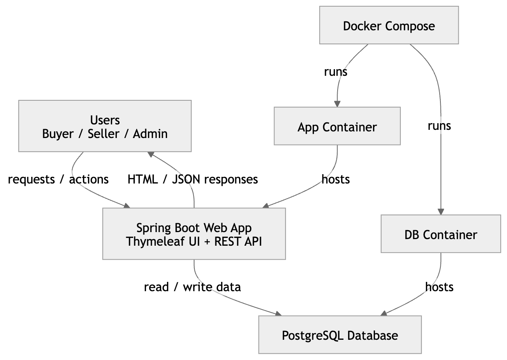
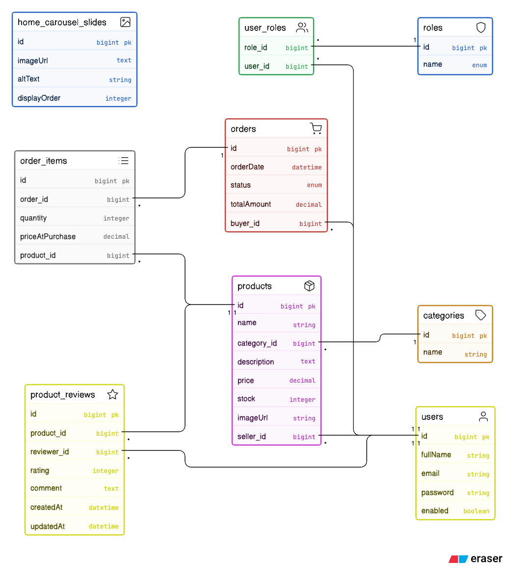

# Mini Marketplace

A full-stack marketplace web application built with Spring Boot, Thymeleaf, and PostgreSQL.

Users can browse products, place orders, and manage activity based on role:
- Buyer: browse products, checkout, track own orders, leave reviews
- Seller: manage products, view seller orders, update order status
- Admin: manage users, products, orders, categories, and home slides

## Live Deployment

Production URL:
- https://mini-marketplace-26bl.onrender.com

## Architecture Diagram



## ER Diagram



## Tech Stack

- Backend: Java 17, Spring Boot, Spring Security, Spring Data JPA
- Frontend: Thymeleaf, Bootstrap 5, custom CSS
- Database: PostgreSQL (H2 for tests)
- Build Tool: Maven Wrapper
- Containerization: Docker, Docker Compose
- CI: GitHub Actions
- Deployment: Render

## Project Structure

```text
src/main/java/com/hasan/marketplace
  controller/
  controller/api/
  service/
  service/impl/
  repository/
  entity/
  dto/
  config/

src/main/resources
  templates/
  static/
  application.yml
```

## API Endpoints (REST)

Base path examples below are from controllers in `controller/api`.

### Product API (`/api/products`)

- `GET /api/products` : list/search products (`keyword`, `categoryId` optional)
- `GET /api/products/{id}` : get product by id
- `POST /api/products` : create product (seller/admin)
- `PUT /api/products/{id}` : update product (seller/admin)
- `DELETE /api/products/{id}` : delete product (seller/admin)

### Order API (`/api/orders`)

- `POST /api/orders` : place order (buyer/admin context)
- `GET /api/orders` : list orders by role (buyer/seller/admin)
- `GET /api/orders/{id}` : order details by role access
- `PATCH /api/orders/{id}/status?status=...` : update status (seller)

### Category API (`/api/categories`)

- `GET /api/categories` : list categories
- `GET /api/categories/{id}` : get category by id
- `POST /api/categories` : create category (admin)
- `PUT /api/categories/{id}` : update category (admin)
- `DELETE /api/categories/{id}` : delete category (admin)

## Main Web Routes (Thymeleaf)

- `GET /` : home + catalog
- `GET /login` : login page
- `GET /register`, `POST /register` : registration
- `GET /products`, `GET /products/{id}` : product listing/details
- `POST /products/{id}/reviews` : add/update review
- `GET /checkout/{productId}` : checkout page
- `POST /orders`, `GET /orders`, `GET /orders/{id}` : buyer/admin order flow
- `GET /seller/dashboard`, `GET /seller/orders` : seller area
- `GET /admin` : admin dashboard
- `GET /admin/users` : user management view
- `GET /admin/products` : product management view
- `GET /admin/orders` : order management view
- `GET /admin/categories` : category management view
- `GET /admin/home-slides` : home carousel management view

## Environment Variables

Create local env file from template:

```bash
cp .env.example .env
```

PowerShell alternative:

```powershell
Copy-Item .env.example .env
```

Important runtime variables:
- `DB_URL` or `SPRING_DATASOURCE_URL`
- `DB_USERNAME` or `SPRING_DATASOURCE_USERNAME`
- `DB_PASSWORD` or `SPRING_DATASOURCE_PASSWORD`
- `ADMIN_PASSWORD`

Optional:
- `ADMIN_EMAIL`
- `PORT`
- `JPA_DDL`
- `SECURITY_LOG_LEVEL`

Notes:
- `.env` is ignored by git.
- Use Render dashboard environment settings in production.

## Run Instructions

### Option 1: Local (Maven)

Prerequisites:
- Java 17+
- PostgreSQL running

Steps:

```bash
./mvnw clean verify
./mvnw spring-boot:run
```

App starts at:
- `http://localhost:8080`

### Option 2: Docker Compose

Prerequisites:
- Docker Desktop / Docker Engine

Steps:

```bash
docker compose up --build -d
docker compose ps
```

Stop:

```bash
docker compose down
```

## CI/CD Explanation

### CI (GitHub Actions)

Workflow file:
- `.github/workflows/ci.yml`

Pipeline behavior:
- Triggers on push to `main` and `develop`, and pull requests to `main`
- Spins up PostgreSQL service container
- Sets test datasource env vars
- Runs:

```bash
./mvnw clean verify
```

### CD (Render)

Render handles deployment of this project at:
- https://mini-marketplace-26bl.onrender.com

Typical flow:
- Code pushed to connected branch
- Render builds and deploys new version
- Runtime env vars are supplied from Render dashboard (not from local `.env`)

## License

Add a license file if you plan to open-source this repository.
